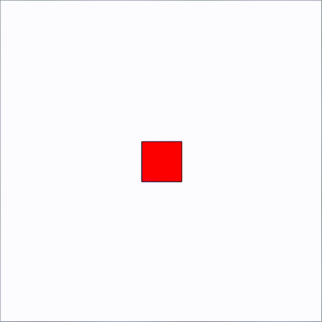

# qshapy project

qshapy is an animation generator for moving graphic objects. The idea for the project was inspired by addictive videos online, and I decided to implement a similar animation with simple geometric shapes. It seems to have turned out pretty well.

Currently, all animations are built around rectangles, but other elements may be added in the future if necessary. The project includes the ability to add elements to any area and change the direction vector of the elements (all by right-clicking).

The project uses the graphics mechanisms in Qt as its graphical foundation.
